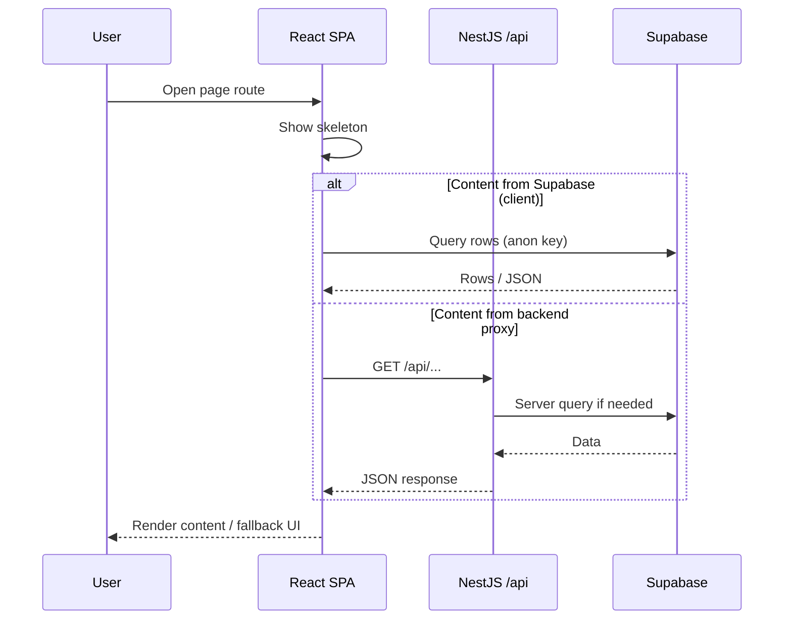
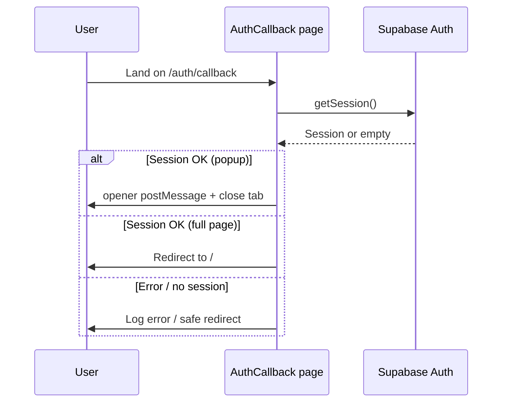
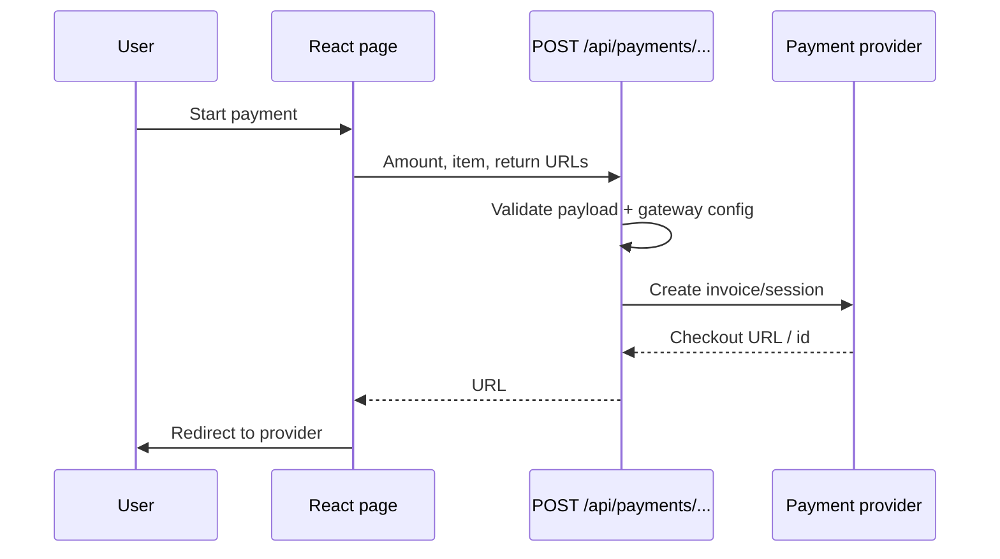
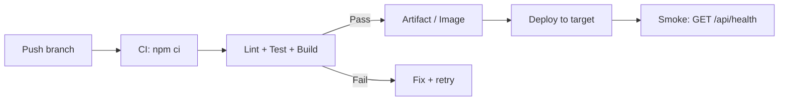

# Product and System Flows

## Diagrams (Mermaid)

These diagrams summarize the flows below. They render on [GitHub](https://docs.github.com/en/get-started/writing-on-github/working-with-advanced-formatting/creating-diagrams#creating-mermaid-diagrams) and in many Markdown tools.

Public content browsing (overview)

Auth callback (OAuth / magic link return)

Payment checkout session creation

CI → deploy (baseline)

## 1) Public Content Consumption Flow

1. User opens site home page.
2. Frontend route renders selected section/page.
3. Page requests content from API/Supabase-backed source.
4. Loading skeleton appears while data is fetched.
5. Content is displayed, with fallback UI if data is missing.

## 2) Authentication Callback Flow

1. User signs in through configured auth provider.
2. Provider redirects user to `/auth/callback`.
3. Frontend checks current session via Supabase auth client.
4. If session exists:
   - popup flow sends success message to opener and closes, or
   - full-page flow redirects user to home/admin route.
5. If error occurs:
   - error is logged,
   - user is redirected to a safe route and can retry login.

## 3) Admin Content Update Flow

1. Authorized user logs in.
2. Admin navigates to dashboard/content management area.
3. User edits content fields (text, media metadata, links).
4. Frontend submits update request to backend/Supabase.
5. Backend validates request and applies update.
6. UI confirms success and updated content is visible publicly.

## 4) Payment Session Creation Flow

1. User initiates payment from eligible page/action.
2. Frontend sends request to `/api/payments/create-checkout-session`.
3. Backend validates:
   - item description,
   - amount boundaries,
   - gateway configuration availability.
4. Backend creates payment invoice/session through provider API.
5. Frontend receives checkout URL and redirects user.
6. User returns to success/cancel route after payment outcome.

## 5) Service Startup Flow

1. Runtime starts server entrypoint.
2. Environment variables are loaded and validated.
3. Nest app initializes modules and middleware.
4. Global API prefix `/api` is configured.
5. Security middleware is applied for non-development environments.
6. Service listens on configured host/port.

## 6) Deployment Flow (Baseline)

1. Developer pushes changes to remote branch.
2. CI runs:
   - dependency install,
   - TypeScript lint check,
   - unit/integration tests,
   - production build.
3. If checks pass, build artifacts/container image are produced.
4. Deployment target is updated (platform-specific rollout step).
5. Post-deploy health probe checks `/api/health`.

## 7) Incident Triage Mini-Flow

1. Detect issue (failed CI, broken route, server startup error).
2. Reproduce locally using same command.
3. Isolate failure layer (frontend, backend, env, deployment config).
4. Patch minimal fix and run lint/test/build.
5. Release fix and verify health endpoint + affected user path.
