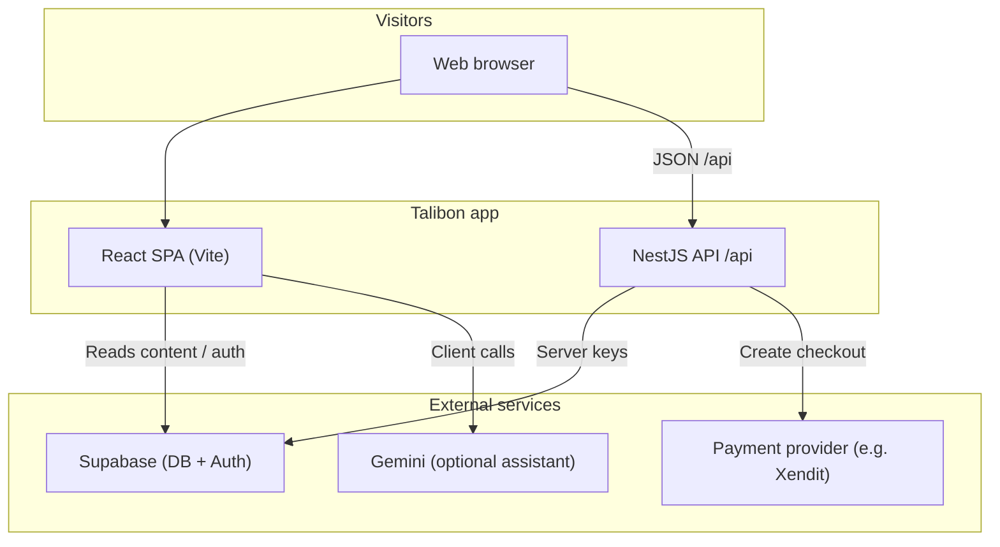

# MVP Overview

## Project

**TALIBON.GOV.PH** is a municipal information and services web platform that combines:

- public information pages,
- transparency records,
- tourism and local content,
- downloadable forms,
- admin-managed content updates,
- and online payment entry points.

## MVP Goals

- Publish a stable, mobile-friendly public website for Talibon.
- Centralize core municipal content in one discoverable platform.
- Enable authenticated admin content updates.
- Provide initial online payment journey integration.
- Establish a repeatable deployment workflow (build, test, release).

## MVP Success Metrics

- Site uptime and successful deployment cadence.
- Public pages load and navigate without major runtime errors.
- Core APIs (`/api/*`) respond reliably.
- Content updates from authorized users are reflected correctly.
- Payment session creation works for valid requests.

## In-Scope for MVP

- Frontend: React + Vite + TypeScript.
- Backend: NestJS API and server runtime.
- Data/Auth: Supabase (content and authentication).
- Security baseline: environment validation, server security headers.
- Build quality gates: lint, test, and production build.
- Basic health endpoint for infrastructure checks.

## Out of Scope for MVP (Phase 2+)

- Advanced observability dashboards and alerting stack.
- Full analytics and deep reporting.
- Multi-tenant architecture or multi-municipality support.
- Complex workflow engines (approvals, audits, policy automation).
- High-availability multi-region deployment.

## Current Technical Stack

- **Frontend:** React 19, React Router, Tailwind CSS, Motion.
- **Backend:** NestJS, Express runtime.
- **Data/Auth:** Supabase client libraries.
- **Payments:** Xendit integration (session/invoice creation flow).
- **Tooling:** TypeScript, Vitest, Vite bundler.
- **CI baseline:** workflow for lint, test, and build checks.

## Architecture Snapshot

- UI routes are served by the frontend app.
- Backend APIs are served under `/api` prefix.
- Frontend fetches content and service endpoints from backend and Supabase.
- Server validates environment variables at startup.
- Health checks can probe `/api/health` to verify service health.

### High-Level Architecture Diagram

Open Mermaid diagram (renders on GitHub and many Markdown viewers)

## MVP Risks and Mitigations

- **Risk:** Environment mismatch between local and production.  
  **Mitigation:** Strict `.env` schema validation and documented required variables.

- **Risk:** Regressions during fast iteration.  
  **Mitigation:** Keep lint/test/build green before each push.

- **Risk:** Large frontend bundles affecting load performance.  
  **Mitigation:** Manual chunking and route-based lazy loading strategy.

- **Risk:** Deployment drift across platforms.  
  **Mitigation:** Keep deployment docs and configs in version control.
